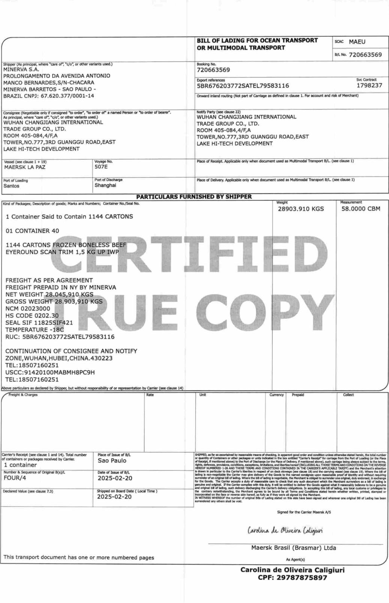

<html><body><table><tbody><tr><td>B/L:720663569</td><td>Page：2</td><td>CONTACT:YEJIA</td><td>EMAIL:CAIGOU1@CJITG.COM</td><td>YEJIA@CJITG.COM</td></tr><tr><td>0/79583-116</td><td>MNBU3692082 ML-BR0638171 40REEF9'6 1144CARTONS 28903.910KGS58.0000</td><td>CBM</td><td>Temperature:-18.0C</td><td>VeterinarianSeal：11825SIF421</td></tr><tr><td>SHIPPER'SLOAD,STOW,WEIGHTANDCOUNT</td><td>VERYIMPORTANT:Containerdetentiontariffsand conditionsapplicablefortheportof</td><td>loading,includingthe free time,canbeobtainedwith localagentsandareavailableat the</td><td>carrierswebsite,at:</td><td>https://www.maersk.com/local-information/latin-america/brazil/export.Samedemurrage</td></tr><tr><td>anddetention conditionsareregistered inthe DocumentsRegistry Notary Office in thecity</td><td>ofSantos,undernumber732.745 andareregardeda legalpartofthisBillofLading,</td><td>remainingvaliduntil newconditions/tariffstoberegistered in therespective Document</td><td>Registry NotaryOffice,whichwillprevail.</td><td>Demurrageand Detention dealsare based on the Price Calculation Date of your shipments.</td></tr><tr><td>Notethat thesedemurrageand detentionconditionsshallnotapplyifthe</td><td>booking/shipmentwasplaced underMaersk Spot（instant bookingsystem) conditions</td><td>whichareavailableatthecarrierswebsiteat</td><td>https://terms.maerskline.com/terms-spot-bookingandwhich shall supersedeany</td><td>separatelyagreedterms.Incaseofdoubts,pleasecheckwith theShipperor local agents</td></tr><tr><td>themodality of booking/shipment thatwas hired</td><td>Shipperassumes before the shipownerthe contractual and legal duty to export/ship their</td><td>cargo toaConsigneewho hasreal interestand conditionsinacquiring/receivingthe</td><td>importedcargo,promotingitseffectiveremoval atthedestination,withthe fulfillmentofall</td><td>obligationsinherent tothisact.If thecargoisabandonedatitsdestinationorifitisnot</td></tr><tr><td>removedbytheConsigneeforanyreason,theShipperwillbejointlyand severallyliable,</td><td></td><td></td><td></td><td></td></tr><tr><td>Freight &Charges</td><td>Rate</td><td>Unit</td><td>Currency</td><td>Prepaid</td></tr><tr><td></td><td></td><td></td><td></td><td></td></tr><tr><td></td><td></td><td></td><td></td><td></td></tr><tr><td></td><td></td><td></td><td></td><td></td></tr><tr><td></td><td></td><td></td><td></td><td></td></tr><tr><td></td><td></td><td></td><td></td><td></td></tr><tr><td></td><td></td><td></td><td></td><td></td></tr><tr><td></td><td></td><td></td><td></td><td></td></tr><tr><td></td><td></td><td></td><td></td><td></td></tr><tr><td></td><td></td><td></td><td></td><td></td></tr><tr><td></td><td></td><td></td><td></td><td></td></tr><tr><td></td><td></td><td></td><td></td><td></td></tr><tr><td></td><td></td><td></td><td></td><td></td></tr><tr><td></td><td></td><td></td><td></td><td></td></tr><tr><td></td><td></td><td></td><td></td><td></td></tr><tr><td></td><td></td><td></td><td></td><td></td></tr><tr><td></td><td></td><td></td><td></td><td></td></tr><tr><td></td><td></td><td></td><td></td><td></td></tr><tr><td></td><td></td><td></td><td></td><td></td></tr><tr><td></td><td></td><td></td><td></td><td></td></tr><tr><td></td><td></td><td></td><td></td><td></td></tr><tr><td></td><td></td><td></td><td></td><td></td></tr><tr><td></td><td></td><td></td><td></td><td></td></tr><tr><td></td><td></td><td></td><td></td><td></td></tr><tr><td></td><td></td><td></td><td></td><td></td></tr><tr><td></td><td></td><td></td><td></td><td></td></tr><tr><td></td><td></td><td></td><td></td><td></td></tr><tr><td></td><td></td><td></td><td></td><td></td></tr><tr><td></td><td></td><td></td><td></td><td></td></tr><tr><td></td><td></td><td></td><td></td><td></td></tr><tr><td></td><td></td><td></td><td></td><td></td></tr><tr><td></td><td></td><td></td><td></td><td></td></tr><tr><td></td><td></td><td></td><td></td><td></td></tr><tr><td></td><td></td><td></td><td></td><td></td></tr><tr><td></td><td></td><td></td><td></td><td></td></tr><tr><td></td><td></td><td></td><td></td><td></td></tr><tr><td></td><td></td><td></td><td></td><td></td></tr><tr><td></td><td></td><td></td><td></td><td></td></tr><tr><td></td><td></td><td></td><td></td><td></td></tr><tr><td></td><td></td><td></td><td></td><td></td></tr><tr><td></td><td></td><td></td><td></td><td></td></tr><tr><td></td><td></td><td></td><td></td><td></td></tr><tr><td></td><td></td><td></td><td></td><td></td></tr><tr><td></td><td></td><td></td><td></td><td></td></tr><tr><td></td><td></td><td></td><td></td><td></td></tr><tr><td></td><td></td><td></td><td></td><td></td></tr><tr><td></td><td></td><td></td><td></td><td></td></tr><tr><td></td><td></td><td></td><td></td><td></td></tr><tr><td></td><td></td><td></td><td></td><td></td></tr><tr><td></td><td></td><td></td><td></td><td></td></tr><tr><td></td><td></td><td></td><td></td><td></td></tr><tr><td></td><td></td><td></td><td></td><td></td></tr><tr><td></td><td></td><td></td><td></td><td></td></tr><tr><td></td><td></td><td></td><td></td><td></td></tr><tr><td></td><td></td><td></td><td></td><td></td></tr><tr><td></td><td></td><td></td><td></td><td></td></tr><tr><td></td><td></td><td></td><td></td><td></td></tr><tr><td></td><td></td><td></td><td></td><td></td></tr><tr><td></td><td></td><td></td><td></td><td></td></tr><tr><td></td><td></td><td></td><td></td><td></td></tr><tr><td></td><td></td><td></td><td></td><td></td></tr><tr><td></td><td></td><td></td><td></td><td></td></tr><tr><td></td><td></td><td></td><td></td><td></td></tr><tr><td></td><td></td><td></td><td></td><td></td></tr><tr><td></td><td></td></table></body></html>

<html><body><table><tbody><tr><td>B/L:720663569</td><td>Page：3</td><td>together with theConsignee,forallamounts,cost,expense,damage orloss that carrier</td><td>maysufferasaresult ofthis situation.</td><td>FREIGHTPREPAID</td></tr><tr><td colspan="5">Goodsshipped inrefrigerated container(s) setat shipper'srequestedcarriage temperature</td></tr><tr><td colspan="2">asperabove</td><td>TheMerchant(s)warrantand represent that this shipmentand/orGoodswillcomplyatall timeswith European Union,UnitedStatesand UnitedNations sanctionsand/orexport control laws(SanctionsLaws),and that this shipmentand/orGoodsdonot involve,</td><td>whetherdirectlyorindirectly,anyentityorpersonidentified,orownedorcontrolledbyany suchentity orperson identified,ontheU.S.Treasury DepartmentsOfficeof Foreign Asset Control (OFAC) listofSpecially Designated Nationalsand BlockedPersons,oranyother similarlistmaintainedby the European Union,oraspromulgated by the United Nations</td><td>Security Council (Designated Person).If,in the Carrersreasonableopinion,this shipment and/orGoodsarein violation of theCarrierspolicy on Russia [https://www.maersk.com/news/articles/2o22/02/24/russia-ukraine-situation-update], Sanctions Lawsor involvesany Designated Person,the shipmentand/orGoodswill be returnedtothe originatCarriers soleand unfettered discretion,and the Merchant(s)shall</td></tr><tr><td colspan="2">and/orGoodsarein violation of theCarrierspolicy on Russia</td><td>indemnifyand hold harmlesstheCarrier,itsservantsandagents,foranybreachof this clause.The Merchant(s)agree that theCarriermay stop theshipmentand/orGoodsin transit orwithhold release of the shipment and/orGoodspending any investigation into</td><td>compliance with thisclauseby the Merchant(s).</td><td>CY/CY</td></tr><tr><td>Freight&Charges</td><td>Uni</td><td>Currency</td><td>Prepaid</td><td>Collect</td></tr></tbody></table></body></html>